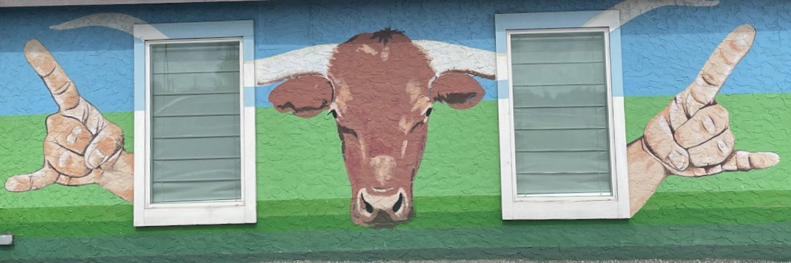

## Hey, I'm Savi!

I like building stuff for myself and others. My origin story is that in 2020 my friends and I built Teens4Help. A website where the immunocompromised in Houston could order groceries to their homes for free. We were able to connect hundreds of volunteers with the thousands in need and even partnered with the Houston Mayor's team.

## Public Projects

- [UT-gpt](https://www.utgpt.dev/) (ed tech) - An AI academic advisor trained on courses, degree requirements, and official university documents
- [ConocoPhillips ML Research](https://colab.research.google.com/drive/1ql-owag8wF0m1JnmsRed7XQTnsyedbbp?usp=sharing) - Predicting Texas energy grid load using climate data to better prepare for future winter storms

## Socials

- [Twitter](https://twitter.com/savi_eth)
- [LinkedIn](https://www.linkedin.com/in/savindu-wimalasooriya/)
